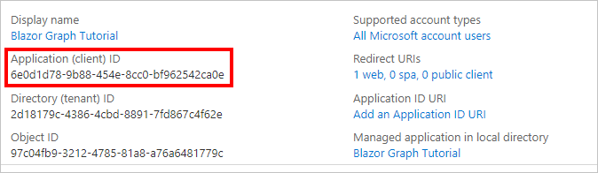

# <a name="how-to-run-the-completed-project"></a>Como executar o projeto concluído

## <a name="prerequisites"></a>Pré-requisitos

Para executar o projeto concluído nessa pasta, você precisará do seguinte:

- O [SDK do .NET Core](https://dotnet.microsoft.com/download) instalado em sua máquina de desenvolvimento. (**Observação:** este tutorial foi escrito com o .NET Core SDK versão 3.1.402. As etapas deste guia podem funcionar com outras versões, mas que não foram testadas.
- Uma conta pessoal da Microsoft com uma caixa de correio no Outlook.com ou uma conta corporativa ou de estudante da Microsoft.

Se você não tem uma conta da Microsoft, há algumas opções para obter uma conta gratuita:

- Você pode [se inscrever para uma nova conta pessoal da Microsoft](https://signup.live.com/signup?wa=wsignin1.0&rpsnv=12&ct=1454618383&rver=6.4.6456.0&wp=MBI_SSL_SHARED&wreply=https://mail.live.com/default.aspx&id=64855&cbcxt=mai&bk=1454618383&uiflavor=web&uaid=b213a65b4fdc484382b6622b3ecaa547&mkt=E-US&lc=1033&lic=1).
- Você pode [se inscrever no programa para desenvolvedores do office 365](https://developer.microsoft.com/office/dev-program) para obter uma assinatura gratuita do Office 365.

## <a name="register-a-web-application-with-the-azure-active-directory-admin-center"></a>Registrar um aplicativo Web com o centro de administração do Azure Active Directory

1. Abra um navegador e navegue até o [centro de administração do Azure Active Directory](https://aad.portal.azure.com). Faça logon usando uma **conta pessoal** (também conhecida como Conta da Microsoft) ou **Conta Corporativa ou de Estudante**.

1. Selecione **Azure Active Directory** na navegação esquerda e selecione **Registros de aplicativos** em **Gerenciar**.

    

1. Selecione **Novo registro**. Na página **Registrar um aplicativo**, defina os valores da seguinte forma.

    - Defina **Nome** para `Blazor Graph Tutorial`.
    - Defina **Tipos de conta com suporte** para **Contas em qualquer diretório organizacional e contas pessoais da Microsoft**.
    - Em **URI de Redirecionamento**, defina o primeiro menu suspenso para `Web` e defina o valor como `https://localhost:5001/authentication/login-callback`.

    

1. Selecione **Registrar**. Na página de **tutorial do gráfico** mais novo, copie o valor da **ID do aplicativo (cliente)** e salve-o, você precisará dele na próxima etapa.

    

1. Selecione **Autenticação** em **Gerenciar**. Localize a seção **Grant implícita** e habilite **tokens de acesso** e **tokens de ID**. Selecione **Salvar**.

## <a name="configure-the-sample"></a>Configurar o exemplo

1. Renomeie o **/GraphTutorial/wwwroot/appsettings.example.jsno** arquivo para **appsettings.js**.

1. Edite **appsettings.js** e substitua `YOUR_APP_ID_HERE` pela ID do aplicativo.

## <a name="run-the-sample"></a>Executar o exemplo

Na sua CLI, execute o seguinte comando para iniciar o aplicativo.

```Shell
dotnet run
```
