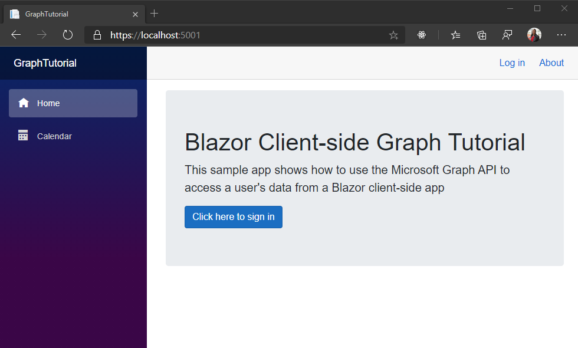

<!-- markdownlint-disable MD002 MD041 -->

Comece criando um aplicativo Webassembly de mais.

1. Abra a interface de linha de comando (CLI) em um diretório onde você deseja criar o projeto. Execute o seguinte comando.

    ```Shell
    dotnet new blazorwasm --auth SingleOrg -o GraphTutorial
    ```

    O `--auth SingleOrg` parâmetro faz com que o projeto gerado inclua a configuração de autenticação com a plataforma de identidade da Microsoft.

1. Depois que o projeto for criado, verifique se ele funciona alterando o diretório atual para o diretório **GraphTutorial** e executando o seguinte comando na sua CLI.

    ```Shell
    dotnet watch run
    ```

1. Abra o navegador e navegue até `https://localhost:5001` . Se tudo estiver funcionando, você deverá ver um "Olá, mundo!" Mensagem.

> [!IMPORTANT]
> Se você receber um aviso de que o certificado para **localhost** é não confiável, você pode usar a CLI do .NET Core para instalar e confiar no certificado de desenvolvimento. Consulte [impor HTTPS no ASP.NET Core](/aspnet/core/security/enforcing-ssl?view=aspnetcore-3.1) para obter instruções para sistemas operacionais específicos.

## <a name="add-nuget-packages"></a>Adicionar pacotes NuGet

Antes de prosseguir, instale alguns pacotes NuGet adicionais que serão usados posteriormente.

- [Microsoft. Graph](https://www.nuget.org/packages/Microsoft.Graph/) para fazer chamadas para o Microsoft Graph.
- [Timezoneconverter](https://github.com/mj1856/TimeZoneConverter) para conversão de identificadores de fuso horário do Windows em identificadores da IANA.

1. Execute os seguintes comandos em sua CLI para instalar as dependências.

    ```Shell
    dotnet add package Microsoft.Graph --version 3.18.0
    dotnet add package TimeZoneConverter
    ```

## <a name="design-the-app"></a>Projetar o aplicativo

Nesta seção, você criará a estrutura básica de interface do usuário do aplicativo.

1. Remover exemplos de páginas geradas pelo modelo. Exclua os arquivos a seguir.

    - **./Pages/Counter.razor**
    - **./Pages/FetchData.razor**
    - **./Shared/SurveyPrompt.razor**
    - **./wwwroot/Sample-data/weather.jsem**

1. Abra **./wwwroot/index.html** e adicione o seguinte código imediatamente **antes** da marca de fechamento `</body>` .

    :::code language="html" source="../demo/GraphTutorial/wwwroot/index.html" id="BootStrapJSSnippet":::

    Isso adiciona os arquivos de [inicialização](https://getbootstrap.com/docs/4.5/getting-started/introduction/) JavaScript.

1. Abra **./wwwroot/CSS/app.css** e adicione o código a seguir.

    :::code language="css" source="../demo/GraphTutorial/wwwroot/css/app.css" id="CssSnippet":::

1. Abra **./Shared/NavMenu.Razor** e substitua seu conteúdo pelo seguinte.

    :::code language="razor" source="../demo/GraphTutorial/Shared/NavMenu.razor" id="NavMenuSnippet":::

1. Abra **./pages/index.Razor** e substitua seu conteúdo pelo seguinte.

    :::code language="razor" source="../demo/GraphTutorial/Pages/Index.razor" id="IndexSnippet":::

1. Abra **./Shared/LoginDisplay.Razor** e substitua seu conteúdo pelo seguinte.

    ```razor
    @using Microsoft.AspNetCore.Components.Authorization
    @using Microsoft.AspNetCore.Components.WebAssembly.Authentication

    @inject NavigationManager Navigation
    @inject SignOutSessionStateManager SignOutManager

    <AuthorizeView>
        <Authorized>
            <a class="text-decoration-none" data-toggle="dropdown" href="#" role="button">
                
            </a>
            <div class="dropdown-menu dropdown-menu-right">
                <h5 class="dropdown-item-text mb-0">@context.User.Identity.Name</h5>
                <p class="dropdown-item-text text-muted mb-0">placeholder@contoso.com</p>
                <div class="dropdown-divider"></div>
                <button class="dropdown-item" @onclick="BeginLogout">Log out</button>
            </div>
        </Authorized>
        <NotAuthorized>
            <a href="authentication/login">Log in</a>
        </NotAuthorized>
    </AuthorizeView>

    @code{
        private async Task BeginLogout(MouseEventArgs args)
        {
            await SignOutManager.SetSignOutState();
            Navigation.NavigateTo("authentication/logout");
        }
    }
    ```

1. Crie um novo diretório no diretório **./wwwroot** chamado **img**. Adicione um arquivo de imagem de sua escolha nomeada **no-profile-photo.png** nesse diretório. Esta imagem será usada como foto do usuário quando o usuário não tiver nenhuma foto no Microsoft Graph.

    > [!TIP]
    > É possível baixar a imagem usada nessas capturas de tela do [GitHub](https://github.com/microsoftgraph/msgraph-training-blazor-clientside/blob/master/demo/GraphTutorial/wwwroot/img/no-profile-photo.png).

1. Salve todas as suas alterações e atualize a página.

    
