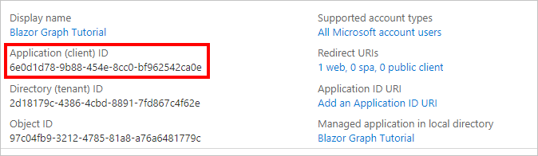

<!-- markdownlint-disable MD002 MD041 -->

Neste exercício, você criará um novo registro de aplicativo Web do Azure AD usando o centro de administração do Azure Active Directory.In this exercise, you will create a new Azure AD web application registration using the Azure Active Directory admin center.

1. Abra um navegador e navegue até o [centro de administração do Azure Active Directory](https://aad.portal.azure.com).Open a browser and navigate to the [Azure Active Directory admin center](https://aad.portal.azure.com). Faça logon usando uma **conta pessoal** (também conhecida como Conta da Microsoft) ou **Conta Corporativa ou de Estudante**.Login using a **personal account** (aka: Microsoft Account) or **Work or School Account**.

1. Selecione **Azure Active Directory** na navegação esquerda e selecione **Registros de aplicativos** em **Gerenciar**.Select **Azure Active Directory** in the left-hand navigation, then select **App registrations** under **Manage**.

    

1. Selecione **Novo registro**.Select **New registration**. Na página **Registrar um aplicativo**, defina os valores da seguinte forma.On the **Register an application** page, set the values as follows.

    - Defina **Nome** para `Blazor Graph Tutorial`.Set **Name** to `Blazor Graph Tutorial`.
    - Defina **Tipos de conta com suporte** para **Contas em qualquer diretório organizacional e contas pessoais da Microsoft**.Set **Supported account types** to **Accounts in any organizational directory and personal Microsoft accounts**.
    - Em **URI de Redirecionamento**, defina o primeiro menu suspenso para `Web` e defina o valor como `https://localhost:5001/authentication/login-callback`.Under **Redirect URI**, set the first drop-down to `Web` and set the value to `https://localhost:5001/authentication/login-callback`.

    

1. Selecione **Registrar**.Select **Register**. Na página de **tutorial do gráfico** mais novo, copie o valor da **ID do aplicativo (cliente)** e salve-o, você precisará dele na próxima etapa.On the **Blazor Graph Tutorial** page, copy the value of the **Application (client) ID** and save it, you will need it in the next step.

    

1. Selecione **Autenticação** em **Gerenciar**.Select **Authentication** under **Manage**. Localize a seção **Grant implícita** e habilite **tokens de acesso** e **tokens de ID**.Locate the **Implicit grant** section and enable **Access tokens** and **ID tokens**. Selecione **Salvar**.Select **Save**.
