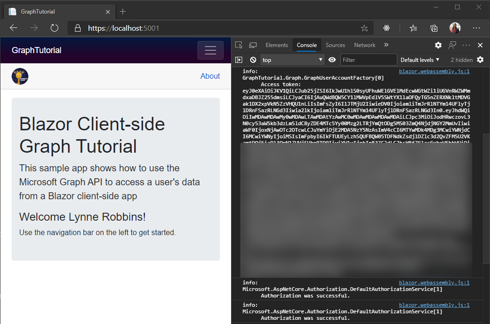

<!-- markdownlint-disable MD002 MD041 -->

<span data-ttu-id="f1a7a-101">Neste exercício, você estenderá o aplicativo do exercício anterior para oferecer suporte à autenticação com o Azure AD.</span><span class="sxs-lookup"><span data-stu-id="f1a7a-101">In this exercise you will extend the application from the previous exercise to support authentication with Azure AD.</span></span> <span data-ttu-id="f1a7a-102">Isso é necessário para obter o token de acesso OAuth necessário para chamar a API do Microsoft Graph.</span><span class="sxs-lookup"><span data-stu-id="f1a7a-102">This is required to obtain the necessary OAuth access token to call the Microsoft Graph API.</span></span>

1. <span data-ttu-id="f1a7a-103">Abrir **./wwwroot/appsettings.jsem**.</span><span class="sxs-lookup"><span data-stu-id="f1a7a-103">Open **./wwwroot/appsettings.json**.</span></span> <span data-ttu-id="f1a7a-104">Adicione uma `GraphScopes` propriedade e atualize os `Authority` `ClientId` valores e para que correspondam ao seguinte.</span><span class="sxs-lookup"><span data-stu-id="f1a7a-104">Add a `GraphScopes` property and update the `Authority` and `ClientId` values to match the following.</span></span>

    :::code language="json" source="../demo/GraphTutorial/wwwroot/appsettings.example.json" highlight="3-4,7":::

    <span data-ttu-id="f1a7a-105">Substitua `YOUR_APP_ID_HERE` pela ID do aplicativo do registro do aplicativo.</span><span class="sxs-lookup"><span data-stu-id="f1a7a-105">Replace `YOUR_APP_ID_HERE` with the application ID from your app registration.</span></span>

    > [!IMPORTANT]
    > <span data-ttu-id="f1a7a-106">Se você estiver usando o controle de origem como o Git, agora seria uma boa hora para excluir o **appsettings.jsno** arquivo do controle de origem para evitar vazar inadvertidamente sua ID de aplicativo.</span><span class="sxs-lookup"><span data-stu-id="f1a7a-106">If you're using source control such as git, now would be a good time to exclude the **appsettings.json** file from source control to avoid inadvertently leaking your app ID.</span></span>

    <span data-ttu-id="f1a7a-107">Revise os escopos incluídos no `GraphScopes` valor.</span><span class="sxs-lookup"><span data-stu-id="f1a7a-107">Review the scopes included in the `GraphScopes` value.</span></span>

    - <span data-ttu-id="f1a7a-108">**User. Read** permite ao aplicativo obter o perfil e a foto do usuário.</span><span class="sxs-lookup"><span data-stu-id="f1a7a-108">**User.Read** allows the application to get the user's profile and photo.</span></span>
    - <span data-ttu-id="f1a7a-109">**MailboxSettings. Read** permite que o aplicativo obtenha configurações de caixa de correio, o que inclui o fuso horário preferencial do usuário.</span><span class="sxs-lookup"><span data-stu-id="f1a7a-109">**MailboxSettings.Read** allows the application to get mailbox settings, which includes the user's preferred time zone.</span></span>
    - <span data-ttu-id="f1a7a-110">**Calendars. ReadWrite** permite que o aplicativo Leia e grave no calendário do usuário.</span><span class="sxs-lookup"><span data-stu-id="f1a7a-110">**Calendars.ReadWrite** allows the application to read and write to the user's calendar.</span></span>

## <a name="implement-sign-in"></a><span data-ttu-id="f1a7a-111">Implementar logon</span><span class="sxs-lookup"><span data-stu-id="f1a7a-111">Implement sign-in</span></span>

<span data-ttu-id="f1a7a-112">Neste ponto, o modelo de projeto do .NET Core adicionou o código para habilitar o logon.</span><span class="sxs-lookup"><span data-stu-id="f1a7a-112">At this point the .NET Core project template has added the code to enable sign in.</span></span> <span data-ttu-id="f1a7a-113">No entanto, nesta seção, você adicionará um código adicional para melhorar a experiência adicionando informações do Microsoft Graph à identidade do usuário.</span><span class="sxs-lookup"><span data-stu-id="f1a7a-113">However, in this section you'll add additional code to improve the experience by adding information from Microsoft Graph to the user's identity.</span></span>

1. <span data-ttu-id="f1a7a-114">Abra **./Pages/Authentication.Razor** e substitua seu conteúdo pelo seguinte.</span><span class="sxs-lookup"><span data-stu-id="f1a7a-114">Open **./Pages/Authentication.razor** and replace its contents with the following.</span></span>

    :::code language="razor" source="../demo/GraphTutorial/Pages/Authentication.razor" id="AuthenticationSnippet":::

    <span data-ttu-id="f1a7a-115">Isso substitui a mensagem de erro padrão quando o logon falha ao exibir qualquer mensagem de erro retornada pelo processo de autenticação.</span><span class="sxs-lookup"><span data-stu-id="f1a7a-115">This replaces the default error message when login fails to display any error message returned by the authentication process.</span></span>

1. <span data-ttu-id="f1a7a-116">Crie um novo diretório na raiz do projeto chamado **Graph**.</span><span class="sxs-lookup"><span data-stu-id="f1a7a-116">Create a new directory in the root of the project named **Graph**.</span></span>

1. <span data-ttu-id="f1a7a-117">Crie um novo arquivo no diretório **./Graph** chamado **GraphUserAccountFactory.cs** e adicione o código a seguir.</span><span class="sxs-lookup"><span data-stu-id="f1a7a-117">Create a new file in the **./Graph** directory named **GraphUserAccountFactory.cs** and add the following code.</span></span>

    ```csharp
    using System.Security.Claims;
    using System.Threading.Tasks;
    using Microsoft.AspNetCore.Components.WebAssembly.Authentication;
    using Microsoft.AspNetCore.Components.WebAssembly.Authentication.Internal;
    using Microsoft.Extensions.Logging;
    using Microsoft.Graph;

    namespace GraphTutorial.Graph
    {
        // Extends the AccountClaimsPrincipalFactory that builds
        // a user identity from the identity token.
        // This class adds additional claims to the user's ClaimPrincipal
        // that hold values from Microsoft Graph
        public class GraphUserAccountFactory
            : AccountClaimsPrincipalFactory<RemoteUserAccount>
        {
            private readonly IAccessTokenProviderAccessor accessor;
            private readonly ILogger<GraphUserAccountFactory> logger;

            public GraphUserAccountFactory(IAccessTokenProviderAccessor accessor,
                ILogger<GraphUserAccountFactory> logger)
            : base(accessor)
            {
                this.accessor = accessor;
                this.logger = logger;
            }

            public async override ValueTask<ClaimsPrincipal> CreateUserAsync(
                RemoteUserAccount account,
                RemoteAuthenticationUserOptions options)
            {
                // Create the base user
                var initialUser = await base.CreateUserAsync(account, options);

                // If authenticated, we can call Microsoft Graph
                if (initialUser.Identity.IsAuthenticated)
                {
                    try
                    {
                        // Add additional info from Graph to the identity
                        await AddGraphInfoToClaims(accessor, initialUser);
                    }
                    catch (AccessTokenNotAvailableException exception)
                    {
                        logger.LogError($"Graph API access token failure: {exception.Message}");
                    }
                    catch (ServiceException exception)
                    {
                        logger.LogError($"Graph API error: {exception.Message}");
                        logger.LogError($"Response body: {exception.RawResponseBody}");
                    }
                }

                return initialUser;
            }

            private async Task AddGraphInfoToClaims(
                IAccessTokenProviderAccessor accessor,
                ClaimsPrincipal claimsPrincipal)
            {
                // TEMPORARY: Get the token and log it
                var result = await accessor.TokenProvider.RequestAccessToken();

                if (result.TryGetToken(out var token))
                {
                    logger.LogInformation($"Access token: {token.Value}");
                }
            }
        }
    }
    ```

    <span data-ttu-id="f1a7a-118">Essa classe estende a classe **AccountClaimsPrincipalFactory** e substitui o `CreateUserAsync` método.</span><span class="sxs-lookup"><span data-stu-id="f1a7a-118">This class extends the **AccountClaimsPrincipalFactory** class and overrides the `CreateUserAsync` method.</span></span> <span data-ttu-id="f1a7a-119">Por enquanto, esse método registra somente o token de acesso para fins de depuração.</span><span class="sxs-lookup"><span data-stu-id="f1a7a-119">For now, this method only logs the access token for debugging purposes.</span></span> <span data-ttu-id="f1a7a-120">Você implementará as chamadas do Microsoft Graph posteriormente neste exercício.</span><span class="sxs-lookup"><span data-stu-id="f1a7a-120">You'll implement the Microsoft Graph calls later in this exercise.</span></span>

1. <span data-ttu-id="f1a7a-121">Abra **./Program.cs** e adicione as seguintes `using` instruções na parte superior do arquivo.</span><span class="sxs-lookup"><span data-stu-id="f1a7a-121">Open **./Program.cs** and add the following `using` statements at the top of the file.</span></span>

    ```csharp
    using Microsoft.AspNetCore.Components.WebAssembly.Authentication;
    using GraphTutorial.Graph;
    ```

1. <span data-ttu-id="f1a7a-122">Dentro `Main` , substitua a `builder.Services.AddMsalAuthentication` chamada existente pelo seguinte.</span><span class="sxs-lookup"><span data-stu-id="f1a7a-122">Inside `Main`, replace the existing `builder.Services.AddMsalAuthentication` call with the following.</span></span>

    :::code language="csharp" source="../demo/GraphTutorial/Program.cs" id="AddMsalAuthSnippet":::

    <span data-ttu-id="f1a7a-123">Considere o que esse código faz.</span><span class="sxs-lookup"><span data-stu-id="f1a7a-123">Consider what this code does.</span></span>

    - <span data-ttu-id="f1a7a-124">Ele carrega o valor de `GraphScopes` de **appsettings.jsem** e adiciona cada escopo aos escopos padrão usados pelo provedor MSAL.</span><span class="sxs-lookup"><span data-stu-id="f1a7a-124">It loads the value of `GraphScopes` from **appsettings.json** and adds each scope to the default scopes used by the MSAL provider.</span></span>
    - <span data-ttu-id="f1a7a-125">Substitui o alocador de conta existente pela classe **GraphUserAccountFactory** .</span><span class="sxs-lookup"><span data-stu-id="f1a7a-125">It replaces the existing account factory with the **GraphUserAccountFactory** class.</span></span>

1. <span data-ttu-id="f1a7a-126">Salve suas alterações e reinicie o aplicativo.</span><span class="sxs-lookup"><span data-stu-id="f1a7a-126">Save your changes and restart the app.</span></span> <span data-ttu-id="f1a7a-127">Use o link **fazer logon** para fazer logon.</span><span class="sxs-lookup"><span data-stu-id="f1a7a-127">Use the **Log in** link to log in.</span></span> <span data-ttu-id="f1a7a-128">Revise e aceite as permissões solicitadas.</span><span class="sxs-lookup"><span data-stu-id="f1a7a-128">Review and accept the requested permissions.</span></span>

1. <span data-ttu-id="f1a7a-129">O aplicativo é atualizado com uma mensagem de boas-vindas.</span><span class="sxs-lookup"><span data-stu-id="f1a7a-129">The app refreshes with a welcome message.</span></span> <span data-ttu-id="f1a7a-130">Acesse as ferramentas de desenvolvedor do navegador e examine a guia **console** . O aplicativo registra o token de acesso.</span><span class="sxs-lookup"><span data-stu-id="f1a7a-130">Access your browser's developer tools and review the **Console** tab. The app logs the access token.</span></span>

    

## <a name="get-user-details"></a><span data-ttu-id="f1a7a-132">Obter detalhes do usuário</span><span class="sxs-lookup"><span data-stu-id="f1a7a-132">Get user details</span></span>

<span data-ttu-id="f1a7a-133">Depois que o usuário estiver conectado, você pode obter as informações do Microsoft Graph.</span><span class="sxs-lookup"><span data-stu-id="f1a7a-133">Once the user is logged in, you can get their information from Microsoft Graph.</span></span> <span data-ttu-id="f1a7a-134">Nesta seção, você usará informações do Microsoft Graph para adicionar declarações adicionais ao **ClaimsPrincipal** do usuário.</span><span class="sxs-lookup"><span data-stu-id="f1a7a-134">In this section you'll use information from Microsoft Graph to add additional claims to the user's **ClaimsPrincipal**.</span></span>

1. <span data-ttu-id="f1a7a-135">Crie um novo arquivo no diretório **./Graph** chamado **GraphClaimsPrincipalExtensions.cs** e adicione o código a seguir.</span><span class="sxs-lookup"><span data-stu-id="f1a7a-135">Create a new file in the **./Graph** directory named **GraphClaimsPrincipalExtensions.cs** and add the following code.</span></span>

    :::code language="csharp" source="../demo/GraphTutorial/Graph/GraphClaimsPrincipalExtensions.cs" id="GraphClaimsExtensionsSnippet":::

    <span data-ttu-id="f1a7a-136">Este código implementa os métodos de extensão da classe **ClaimsPrincipal** que permitem obter e definir declarações com valores de objetos do Microsoft Graph.</span><span class="sxs-lookup"><span data-stu-id="f1a7a-136">This code implements extension methods for the **ClaimsPrincipal** class that allow you to get and set claims with values from Microsoft Graph objects.</span></span>

1. <span data-ttu-id="f1a7a-137">Crie um novo arquivo no diretório **./Graph** chamado **BlazorAuthProvider.cs** e adicione o código a seguir.</span><span class="sxs-lookup"><span data-stu-id="f1a7a-137">Create a new file in the **./Graph** directory named **BlazorAuthProvider.cs** and add the following code.</span></span>

    :::code language="csharp" source="../demo/GraphTutorial/Graph/BlazorAuthProvider.cs" id="BlazorAuthProviderSnippet":::

    <span data-ttu-id="f1a7a-138">Este código implementa um provedor de autenticação para o SDK do Microsoft Graph que usa o **IAccessTokenProviderAccessor** fornecido pelo pacote **Microsoft. AspNetCore. Components. Webassembly. Authentication** para obter tokens de acesso.</span><span class="sxs-lookup"><span data-stu-id="f1a7a-138">This code implements an authentication provider for the Microsoft Graph SDK that uses the **IAccessTokenProviderAccessor** provided by the **Microsoft.AspNetCore.Components.WebAssembly.Authentication** package to get access tokens.</span></span>

1. <span data-ttu-id="f1a7a-139">Crie um novo arquivo no diretório **./Graph** chamado **GraphClientFactory.cs** e adicione o código a seguir.</span><span class="sxs-lookup"><span data-stu-id="f1a7a-139">Create a new file in the **./Graph** directory named **GraphClientFactory.cs** and add the following code.</span></span>

    :::code language="csharp" source="../demo/GraphTutorial/Graph/GraphClientFactory.cs" id="GraphClientFactorySnippet":::

    <span data-ttu-id="f1a7a-140">Essa classe cria um **GraphServiceClient** configurado com o **BlazorAuthProvider**.</span><span class="sxs-lookup"><span data-stu-id="f1a7a-140">This class creates a **GraphServiceClient** configured with the **BlazorAuthProvider**.</span></span>

1. <span data-ttu-id="f1a7a-141">Abra **./Program.cs** e altere o **BaseAddress** do novo **HttpClient** para `"https://graph.microsoft.com"` .</span><span class="sxs-lookup"><span data-stu-id="f1a7a-141">Open **./Program.cs** and change the **BaseAddress** of the new **HttpClient** to `"https://graph.microsoft.com"`.</span></span>

    :::code language="csharp" source="../demo/GraphTutorial/Program.cs" id="HttpClientSnippet":::

1. <span data-ttu-id="f1a7a-142">Adicione o código a seguir antes da `await builder.Build().RunAsync();` linha.</span><span class="sxs-lookup"><span data-stu-id="f1a7a-142">Add the following code before the `await builder.Build().RunAsync();` line.</span></span>

    :::code language="csharp" source="../demo/GraphTutorial/Program.cs" id="AddGraphClientFactorySnippet":::

    <span data-ttu-id="f1a7a-143">Isso adiciona o **GraphClientFactory** como um serviço com escopo que podemos disponibilizar por meio da injeção de dependência.</span><span class="sxs-lookup"><span data-stu-id="f1a7a-143">This adds the **GraphClientFactory** as a scoped service that we can make available via dependency injection.</span></span>

1. <span data-ttu-id="f1a7a-144">Abra **./Graph/GraphUserAccountFactory.cs** e adicione a propriedade a seguir à classe.</span><span class="sxs-lookup"><span data-stu-id="f1a7a-144">Open **./Graph/GraphUserAccountFactory.cs** and add the following property to the class.</span></span>

    ```csharp
    private readonly GraphClientFactory clientFactory;
    ```

1. <span data-ttu-id="f1a7a-145">Atualize o construtor para obter um parâmetro **GraphClientFactory** e atribuí-lo à `clientFactory` propriedade.</span><span class="sxs-lookup"><span data-stu-id="f1a7a-145">Update the constructor to take a **GraphClientFactory** parameter and assign it to the `clientFactory` property.</span></span>

    :::code language="csharp" source="../demo/GraphTutorial/Graph/GraphUserAccountFactory.cs" id="ConstructorSnippet" highlight="2,7":::

1. <span data-ttu-id="f1a7a-146">Substitua a função `AddGraphInfoToClaims` existente pelo seguinte.</span><span class="sxs-lookup"><span data-stu-id="f1a7a-146">Replace the existing `AddGraphInfoToClaims` function with the following.</span></span>

    :::code language="csharp" source="../demo/GraphTutorial/Graph/GraphUserAccountFactory.cs" id="AddGraphInfoToClaimsSnippet":::

    <span data-ttu-id="f1a7a-147">Considere o que esse código faz.</span><span class="sxs-lookup"><span data-stu-id="f1a7a-147">Consider what this code does.</span></span>

    - <span data-ttu-id="f1a7a-148">Ele [Obtém o perfil do usuário](https://docs.microsoft.com/graph/api/user-get).</span><span class="sxs-lookup"><span data-stu-id="f1a7a-148">It [gets the user's profile](https://docs.microsoft.com/graph/api/user-get).</span></span>
        - <span data-ttu-id="f1a7a-149">Ele usa `Select` para limitar quais propriedades são retornadas.</span><span class="sxs-lookup"><span data-stu-id="f1a7a-149">It uses `Select` to limit which properties are returned.</span></span>
    - <span data-ttu-id="f1a7a-150">Ele [Obtém a foto do usuário](https://docs.microsoft.com/graph/api/profilephoto-get).</span><span class="sxs-lookup"><span data-stu-id="f1a7a-150">It [gets the user's photo](https://docs.microsoft.com/graph/api/profilephoto-get).</span></span>
        - <span data-ttu-id="f1a7a-151">Ele solicita especificamente a versão de pixel 48x48 da foto do usuário.</span><span class="sxs-lookup"><span data-stu-id="f1a7a-151">It requests specifically the 48x48 pixel version of the user's photo.</span></span>
    - <span data-ttu-id="f1a7a-152">Ele adiciona as informações ao **ClaimsPrincipal**.</span><span class="sxs-lookup"><span data-stu-id="f1a7a-152">It adds the information to the **ClaimsPrincipal**.</span></span>

1. <span data-ttu-id="f1a7a-153">Abra **./Shared/LoginDisplay.Razor** e faça as seguintes alterações.</span><span class="sxs-lookup"><span data-stu-id="f1a7a-153">Open **./Shared/LoginDisplay.razor** and make the following changes.</span></span>

    - <span data-ttu-id="f1a7a-154">Substituir `/img/no-profile-photo.png` por `@(context.User.GetUserGraphPhoto() ?? "/img/no-profile-photo.png")` .</span><span class="sxs-lookup"><span data-stu-id="f1a7a-154">Replace `/img/no-profile-photo.png` with `@(context.User.GetUserGraphPhoto() ?? "/img/no-profile-photo.png")`.</span></span>
    - <span data-ttu-id="f1a7a-155">Substituir `placeholder@contoso.com` por `@context.User.GetUserGraphEmail()` .</span><span class="sxs-lookup"><span data-stu-id="f1a7a-155">Replace `placeholder@contoso.com` with `@context.User.GetUserGraphEmail()`.</span></span>

    ```razor
    ...
    

    ...

    <p class="dropdown-item-text text-muted mb-0">@context.User.GetUserGraphEmail()</p>
    ...
    ```

1. <span data-ttu-id="f1a7a-156">Salve todas as suas alterações e reinicie o aplicativo.</span><span class="sxs-lookup"><span data-stu-id="f1a7a-156">Save all of your changes and restart the app.</span></span> <span data-ttu-id="f1a7a-157">Faça logon no aplicativo.</span><span class="sxs-lookup"><span data-stu-id="f1a7a-157">Log into the app.</span></span> <span data-ttu-id="f1a7a-158">O aplicativo atualiza para mostrar a foto do usuário no menu superior.</span><span class="sxs-lookup"><span data-stu-id="f1a7a-158">The app updates to show the user's photo in the top menu.</span></span> <span data-ttu-id="f1a7a-159">Selecionar a foto do usuário abre um menu suspenso com o nome do usuário, o endereço de email e um botão de **logoff** .</span><span class="sxs-lookup"><span data-stu-id="f1a7a-159">Selecting the user's photo opens a drop-down menu with the user's name, email address, and a **Log out** button.</span></span>

    

    
