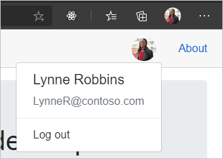

<!-- markdownlint-disable MD002 MD041 -->

Neste exercício, você estenderá o aplicativo do exercício anterior para oferecer suporte à autenticação com o Azure AD. Isso é necessário para obter o token de acesso OAuth necessário para chamar a API do Microsoft Graph.

1. Abrir **./wwwroot/appsettings.jsem**. Adicione uma `GraphScopes` propriedade e atualize os `Authority` `ClientId` valores e para que correspondam ao seguinte.

    :::code language="json" source="../demo/GraphTutorial/wwwroot/appsettings.example.json" highlight="3-4,7":::

    Substitua `YOUR_APP_ID_HERE` pela ID do aplicativo do registro do aplicativo.

    > [!IMPORTANT]
    > Se você estiver usando o controle de origem como o Git, agora seria uma boa hora para excluir o **appsettings.jsno** arquivo do controle de origem para evitar vazar inadvertidamente sua ID de aplicativo.

    Revise os escopos incluídos no `GraphScopes` valor.

    - **User. Read** permite ao aplicativo obter o perfil e a foto do usuário.
    - **MailboxSettings. Read** permite que o aplicativo obtenha configurações de caixa de correio, o que inclui o fuso horário preferencial do usuário.
    - **Calendars. ReadWrite** permite que o aplicativo Leia e grave no calendário do usuário.

## <a name="implement-sign-in"></a>Implementar logon

Neste ponto, o modelo de projeto do .NET Core adicionou o código para habilitar o logon. No entanto, nesta seção, você adicionará um código adicional para melhorar a experiência adicionando informações do Microsoft Graph à identidade do usuário.

1. Abra **./Pages/Authentication.Razor** e substitua seu conteúdo pelo seguinte.

    :::code language="razor" source="../demo/GraphTutorial/Pages/Authentication.razor" id="AuthenticationSnippet":::

    Isso substitui a mensagem de erro padrão quando o logon falha ao exibir qualquer mensagem de erro retornada pelo processo de autenticação.

1. Crie um novo diretório na raiz do projeto chamado **Graph**.

1. Crie um novo arquivo no diretório **./Graph** chamado **GraphUserAccountFactory.cs** e adicione o código a seguir.

    ```csharp
    using System.Security.Claims;
    using System.Threading.Tasks;
    using Microsoft.AspNetCore.Components.WebAssembly.Authentication;
    using Microsoft.AspNetCore.Components.WebAssembly.Authentication.Internal;
    using Microsoft.Extensions.Logging;
    using Microsoft.Graph;

    namespace GraphTutorial.Graph
    {
        // Extends the AccountClaimsPrincipalFactory that builds
        // a user identity from the identity token.
        // This class adds additional claims to the user's ClaimPrincipal
        // that hold values from Microsoft Graph
        public class GraphUserAccountFactory
            : AccountClaimsPrincipalFactory<RemoteUserAccount>
        {
            private readonly IAccessTokenProviderAccessor accessor;
            private readonly ILogger<GraphUserAccountFactory> logger;

            public GraphUserAccountFactory(IAccessTokenProviderAccessor accessor,
                ILogger<GraphUserAccountFactory> logger)
            : base(accessor)
            {
                this.accessor = accessor;
                this.logger = logger;
            }

            public async override ValueTask<ClaimsPrincipal> CreateUserAsync(
                RemoteUserAccount account,
                RemoteAuthenticationUserOptions options)
            {
                // Create the base user
                var initialUser = await base.CreateUserAsync(account, options);

                // If authenticated, we can call Microsoft Graph
                if (initialUser.Identity.IsAuthenticated)
                {
                    try
                    {
                        // Add additional info from Graph to the identity
                        await AddGraphInfoToClaims(accessor, initialUser);
                    }
                    catch (AccessTokenNotAvailableException exception)
                    {
                        logger.LogError($"Graph API access token failure: {exception.Message}");
                    }
                    catch (ServiceException exception)
                    {
                        logger.LogError($"Graph API error: {exception.Message}");
                        logger.LogError($"Response body: {exception.RawResponseBody}");
                    }
                }

                return initialUser;
            }

            private async Task AddGraphInfoToClaims(
                IAccessTokenProviderAccessor accessor,
                ClaimsPrincipal claimsPrincipal)
            {
                // TEMPORARY: Get the token and log it
                var result = await accessor.TokenProvider.RequestAccessToken();

                if (result.TryGetToken(out var token))
                {
                    logger.LogInformation($"Access token: {token.Value}");
                }
            }
        }
    }
    ```

    Essa classe estende a classe **AccountClaimsPrincipalFactory** e substitui o `CreateUserAsync` método. Por enquanto, esse método registra somente o token de acesso para fins de depuração. Você implementará as chamadas do Microsoft Graph posteriormente neste exercício.

1. Abra **./Program.cs** e adicione as seguintes `using` instruções na parte superior do arquivo.

    ```csharp
    using Microsoft.AspNetCore.Components.WebAssembly.Authentication;
    using GraphTutorial.Graph;
    ```

1. Dentro `Main` , substitua a `builder.Services.AddMsalAuthentication` chamada existente pelo seguinte.

    :::code language="csharp" source="../demo/GraphTutorial/Program.cs" id="AddMsalAuthSnippet":::

    Considere o que esse código faz.

    - Ele carrega o valor de `GraphScopes` de **appsettings.jsem** e adiciona cada escopo aos escopos padrão usados pelo provedor MSAL.
    - Substitui o alocador de conta existente pela classe **GraphUserAccountFactory** .

1. Salve suas alterações e reinicie o aplicativo. Use o link **fazer logon** para fazer logon. Revise e aceite as permissões solicitadas.

1. O aplicativo é atualizado com uma mensagem de boas-vindas. Acesse as ferramentas de desenvolvedor do navegador e examine a guia **console** . O aplicativo registra o token de acesso.

    

## <a name="get-user-details"></a>Obter detalhes do usuário

Depois que o usuário estiver conectado, você pode obter as informações do Microsoft Graph. Nesta seção, você usará informações do Microsoft Graph para adicionar declarações adicionais ao **ClaimsPrincipal** do usuário.

1. Crie um novo arquivo no diretório **./Graph** chamado **GraphClaimsPrincipalExtensions.cs** e adicione o código a seguir.

    :::code language="csharp" source="../demo/GraphTutorial/Graph/GraphClaimsPrincipalExtensions.cs" id="GraphClaimsExtensionsSnippet":::

    Este código implementa os métodos de extensão da classe **ClaimsPrincipal** que permitem obter e definir declarações com valores de objetos do Microsoft Graph.

1. Crie um novo arquivo no diretório **./Graph** chamado **BlazorAuthProvider.cs** e adicione o código a seguir.

    :::code language="csharp" source="../demo/GraphTutorial/Graph/BlazorAuthProvider.cs" id="BlazorAuthProviderSnippet":::

    Este código implementa um provedor de autenticação para o SDK do Microsoft Graph que usa o **IAccessTokenProviderAccessor** fornecido pelo pacote **Microsoft. AspNetCore. Components. Webassembly. Authentication** para obter tokens de acesso.

1. Crie um novo arquivo no diretório **./Graph** chamado **GraphClientFactory.cs** e adicione o código a seguir.

    :::code language="csharp" source="../demo/GraphTutorial/Graph/GraphClientFactory.cs" id="GraphClientFactorySnippet":::

    Essa classe cria um **GraphServiceClient** configurado com o **BlazorAuthProvider**.

1. Abra **./Program.cs** e altere o **BaseAddress** do novo **HttpClient** para `"https://graph.microsoft.com"` .

    :::code language="csharp" source="../demo/GraphTutorial/Program.cs" id="HttpClientSnippet":::

1. Adicione o código a seguir antes da `await builder.Build().RunAsync();` linha.

    :::code language="csharp" source="../demo/GraphTutorial/Program.cs" id="AddGraphClientFactorySnippet":::

    Isso adiciona o **GraphClientFactory** como um serviço com escopo que podemos disponibilizar por meio da injeção de dependência.

1. Abra **./Graph/GraphUserAccountFactory.cs** e adicione a propriedade a seguir à classe.

    ```csharp
    private readonly GraphClientFactory clientFactory;
    ```

1. Atualize o construtor para obter um parâmetro **GraphClientFactory** e atribuí-lo à `clientFactory` propriedade.

    :::code language="csharp" source="../demo/GraphTutorial/Graph/GraphUserAccountFactory.cs" id="ConstructorSnippet" highlight="2,7":::

1. Substitua a função `AddGraphInfoToClaims` existente pelo seguinte.

    :::code language="csharp" source="../demo/GraphTutorial/Graph/GraphUserAccountFactory.cs" id="AddGraphInfoToClaimsSnippet":::

    Considere o que esse código faz.

    - Ele [Obtém o perfil do usuário](https://docs.microsoft.com/graph/api/user-get).
        - Ele usa `Select` para limitar quais propriedades são retornadas.
    - Ele [Obtém a foto do usuário](https://docs.microsoft.com/graph/api/profilephoto-get).
        - Ele solicita especificamente a versão de pixel 48x48 da foto do usuário.
    - Ele adiciona as informações ao **ClaimsPrincipal**.

1. Abra **./Shared/LoginDisplay.Razor** e faça as seguintes alterações.

    - Substituir `/img/no-profile-photo.png` por `@(context.User.GetUserGraphPhoto() ?? "/img/no-profile-photo.png")` .
    - Substituir `placeholder@contoso.com` por `@context.User.GetUserGraphEmail()` .

    ```razor
    ...
    

    ...

    <p class="dropdown-item-text text-muted mb-0">@context.User.GetUserGraphEmail()</p>
    ...
    ```

1. Salve todas as suas alterações e reinicie o aplicativo. Faça logon no aplicativo. O aplicativo atualiza para mostrar a foto do usuário no menu superior. Selecionar a foto do usuário abre um menu suspenso com o nome do usuário, o endereço de email e um botão de **logoff** .

    

    
